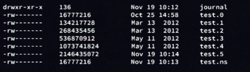
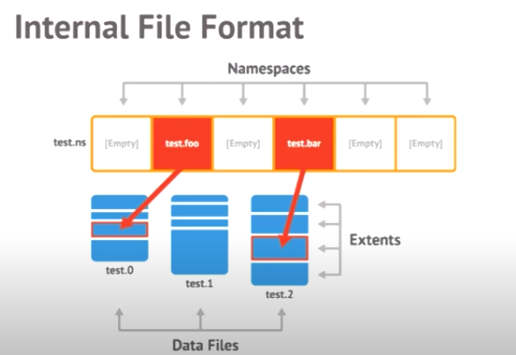
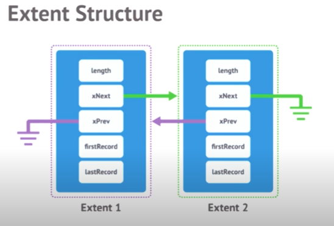

## Why pop the Hood?

- Understanding the data safety
- Estimating RAM
- Optimizing performace

## Storage Layout

- Every database is split into segments i.e single database is not just a single file instead,  it is separated into multiple segments

### Directory Layout



Creating a new Database journal

- These files are the structure of the actual / physical data
- At the time of the creation of new DB, if we don't specify some special parameters the files/data allocates to us before we start using the DB.
    - Because allocating the file is quite expensive and for MongoDB to work properly, we take a file and set every character to 0.
    - `.ns` is a namespace file. a namespace is a collection or an index. `a namespace is a collection of the database name and collection name ex: db.journal()`
- Thier is 1 namespace file per DB which can hold 18000 entries per default

    ## Tuning with Options

    - Use `--drectoryperdb` to separate DB's into own folders which allow using different volumes (isolation, performance)
    - Use `--smallfiles` to keep data files smaller
        - If `using thousands of collections & indexes`, increase namespace capacity with `--nsize`

    ## Internal Structure

    

    DB  does not store data in a continuous fashion in the file. It stored in `extents` i.e small patches of data.  These `extents` are connected through each other via a `linked-list` . This is just because to make more manageable in Memory

    So, basically namespace has `indexes` that have a pointer that is pointing towards the `file` where data resides. In the file, we have different `extents` that store our *document*. 

    ### Extent Architecture

    

    In extent there are several pointers , which we discuss 

    1. Length: As its name suggest it is responsible for the containg the length of the extent
    2. xNext: Point to the next extent (as shown in the above photo)
    3. xPrev: Point to the previous extent , if is not there then points to null
    4. firstRecord: Point toward the first document in the extext
    5. lastRecord: Point toward the last document in the extent

    > `Linked-list of Linked-list` that's how Database is structure internally

    ### Extent and Records

    

    ## Summary:

    - Files on disk are boken into extents which contain the documents
    - A collection has **one or more extents**
    - Extent grow expoentially **up to 2GB**
    - Namespace entries in the *ns* file point to the  **first extent** for that collection

    ## Indexes

    - Indexes are **B-trees**  for structures serialized to disk

    They are stored in the **same files as data** but using **own extents**

    `db.status()` for Database statisitcs and`db.journal.stats()` for Collection statisitcs

    ## Memory Mapping

    - All data filees are **memory mapped**  to tVirtual memory by the OS
    - MongoDB **just reads / writes to the RAM**  in the filesystem cache
    - **OS take care of the rest**

## BSON (Binary JSON)

Data store in the document in the form of **BSON** i.e ***Binary-JSON representation*** . BSON extends the capabilities of JSON data-types 

```json
{
"name" : "Rahul Gupta",
"age" : 25,
"city" : "Delhi",
"county" : "India"
}
```

Data store in BSON havs *`field-value pairs` i.e* name → Field, Rahul Gupta → Value

 - The document can have a **maximum of 16 MB** so that it doesn't use excesses amount of RAM for the operations.

- If Document size is larger than MongoDB has **GridFS**  for storing large document
